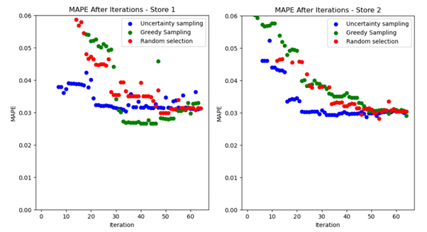
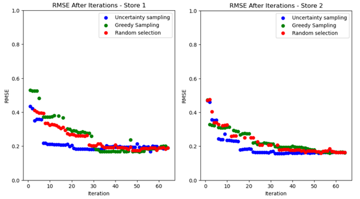
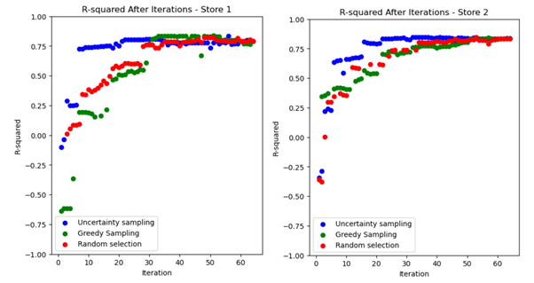

# Active Learning for Price Optimisation

## Using Machine Learning to Reduce Price Experimentation Costs

## Project Overview

This project was conducted in collaboration with **Peak**, an enterprise AI company that develops decision intelligence solutions for pricing, inventory, and supply chain optimisation.

The research investigates how **Active Learning (AL)** can improve **price optimisation and demand forecasting** while reducing the amount of data required for training predictive models.

Traditional pricing models require businesses to test many price points to understand **price elasticity of demand**, which can be costly and risky. This project explores whether **Active Learning algorithms can intelligently guide price experimentation**, enabling companies to learn optimal pricing strategies using significantly fewer data points.

The research demonstrates that **Active Learning techniques can achieve comparable model accuracy with up to ~30% fewer data points**, reducing the cost of pricing experimentation while accelerating model learning.

This work reflects a real-world business challenge faced by AI-driven pricing platforms: **how to maximise model learning while minimising costly pricing experiments**.

---

# Business Problem

Companies frequently struggle to determine optimal prices due to:

- Limited historical price variation
- High cost of price experimentation
- Uncertainty in customer demand responses
- Risk of profit loss during pricing experiments

This project addresses the question:

> **Can machine learning models intelligently choose which price points to test in order to learn price elasticity faster?**

---

# Dataset

A **synthetic retail dataset** was used containing:

- **844,560 observations**
- **391 products**
- **20 store locations**
- Weekly sales data between **2021–2023**

### Key Variables

- Selling Price
- Sales Units
- Sales Value
- Cost
- Profit Margin
- Product ID
- Store Location
- Date

For modelling simplicity, analysis focuses on **one product at one store location** with sufficient price variation.

---

# Methodology

The modelling pipeline consists of the following steps.

## 1. Data Preprocessing

- Log transformation of **price and sales**
- Time-series decomposition
- Seasonal feature engineering

The dataset was split into three subsets:

| Dataset | Purpose |
|------|------|
| Train | Initial model training |
| Pool | Unlabelled data used for Active Learning |
| Test | Final model evaluation |

---

# Demand Prediction Model

A **Linear Regression model** was used to estimate **price elasticity of demand**.

```
Sales = β0 + β1 * Price + β2 * Seasonality + ε
```

The price coefficient represents **price elasticity**, which indicates how sensitive demand is to price changes.

### Baseline Model Performance

| Metric | Result |
|------|------|
| R² | ~0.25 |
| MAPE | Moderate |
| RMSE | Moderate |

This baseline model provides a reference point before applying **Active Learning techniques**.

---

# Active Learning Framework

Instead of randomly selecting additional training data, **Active Learning selects the most informative data points** to improve model performance faster.

Three strategies were compared.

---

## 1. Uncertainty Sampling

The model selects observations where prediction uncertainty is highest.

### Process

1. Train multiple bootstrap regression models
2. Predict demand for all observations in the pool
3. Calculate **prediction variance**
4. Select the observation with the **highest uncertainty**

This prioritises data points that provide the **most new information** for the model.

---

## 2. Greedy Sampling

Greedy Sampling selects observations where the model's predictions differ the most from existing labelled data, focusing on areas where the model performs worst.

---

## 3. Random Sampling (Baseline)

Random data points are selected and added to the training dataset for comparison.

---

# Active Learning Cycle

Each iteration follows the process below:

1. Select the most informative data point
2. Add the observation to the training dataset
3. Retrain the regression model
4. Evaluate performance
5. Repeat

results/Active_Learning_Cycle.png

---

# Evaluation Metrics

Model performance was measured using the following metrics.

### MAPE (Mean Absolute Percentage Error)

Measures the average percentage prediction error.



### RMSE (Root Mean Squared Error)

Measures prediction accuracy while penalising large errors.



### R² (Coefficient of Determination)

Measures the proportion of variance in sales explained by the model.



---

# Key Results

## Faster Model Learning

Uncertainty Sampling significantly accelerated model convergence.

| Method | Iterations to Convergence |
|------|------|
| Uncertainty Sampling | ~22 |
| Random Sampling | ~28 |
| Greedy Sampling | ~31 |

This represents approximately **30% fewer required data points**.

---

## Improved Prediction Accuracy

Uncertainty Sampling consistently achieved:

- Lower **MAPE**
- Lower **RMSE**
- Higher **R²**

compared to random sampling during early training iterations.

---

## Pricing Optimisation Performance

The trained model was used to determine prices that maximise:

- **Sales volume**
- **Profit**

Results show that Active Learning helps the model **identify optimal price levels faster**, improving pricing experimentation efficiency.

---

# Business Impact

This methodology enables organisations to:

- Reduce **price experimentation costs**
- Learn **price elasticity faster**
- Accelerate **pricing strategy deployment**
- Improve **revenue optimisation**

Industries where this approach is particularly valuable include:

- Retail
- E-commerce
- Airlines
- Dynamic pricing platforms

---

# Technologies Used

- Python
- Pandas
- NumPy
- Scikit-learn
- Time Series Analysis
- Active Learning
- Regression Modelling
- Data Visualisation

---

# Repository Structure

```
active-learning-price-optimization
│
├── report
├── notebooks
├── results
└── requirements.txt
```

---

# Future Improvements

Potential extensions include:

- Incorporating **competitor pricing**
- Building **multi-product demand models**
- Implementing **reinforcement learning for dynamic pricing**
- Testing the framework on **real-world retail datasets**

---
